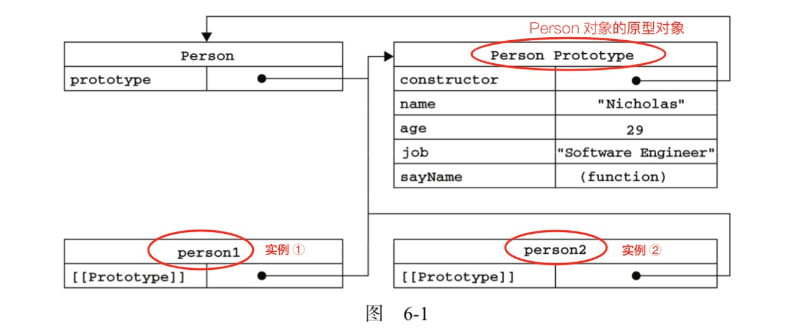

---
nav:
  title: 面试
  order: 2
group:
  title: JavaScript
  order: 5
title: 语言基础
order: 1
---

# JavaScript 语言基础

## 0. JavaScript 技术概览

运行宿主：浏览器、Node
技术标准：ECMAScript、DOM/BOM API（浏览器）、WEB API（Node 文件、数据库、网络、与操作系统的交互）=

## 1. JavaScript 数据类型

### 1).基本数据类型（或原始数据类型）

7 种基本数据类型 ▶ `栈内存`存储的是值

- Null （表示缺少的标识，指示变量未指向任何对象）
- Undefined（一个没有被赋值的变量会有个默认值 undefined，也就说已存在，但还没值）
- Number（基于 IEEE 754 标准的`双精度` 64 位`二进制`格式的值（-(2^53 -1) 到 2^53 -1））
- String
- Boolean
- Symbol (ECMAScript 6 新定义，用于唯一的标识符，比如身份证号码。)
- BigInt（ECMAScript 2020 新提案，用于任意长度的整数。）

> - 在 JavaScript 中，Number 的最大数字是 2^53-1，比 2^53-1 大的所有数字可以使用 BigInt 表达。
> - 如果后端 API 返回了一个大于 2^53-1 的数字怎么办？ 可让后端转换成字符串形式
> - `undefined`和`null`的一些故事 ▶ [Link](https://2ality.com/2021/01/undefined-null-revisited.html)

### 2).复杂数据类型（或引用数据类型）

1 种复杂(对象)数据类型 ▶ `堆内存`存储的是地址

- 数组（Array）
- 函数（Function）
- 正则（RegExp）
- 日期（Date）

## 2. script 标签属性

```javascript
<script src="example-url.js" async或defer type="text/javascript"></script>
```

async 规定一旦脚本可用，则会异步执行。
defer 属性规定是否对脚本执行进行延迟，直到页面加载为止。
一般还是把应用的执行脚本（非类库）放在 body 结束的位置。

详细介绍可以阅读 MDN [《 \<script>-HTML 章节 》](https://developer.mozilla.org/zh-CN/docs/Web/HTML/Element/script)。

## 3. 数组(Array)

常用数组方法

详细参考：[JavaScript 标准内置对象 Array](https://developer.mozilla.org/zh-CN/docs/Web/JavaScript/Reference/Global_Objects/Array)

举例：

```javascript
Array.prototype.concat() - 用于合并两个或多个数组。此方法不会更改现有数组，而是返回一个新数组。
Array.prototype.copyWithin() - 浅复制数组的一部分到同一数组中的另一个位置，并返回它，不会改变原数组的长度。
Array.prototype.entries() - 返回一个新的 Array Iterator 对象，该对象包含数组中每个索引的键/值对。
Array.prototype.fill() - 用一个固定值去填充一个数组中从起始索引到终止索引内的全部元素。不含终止索引。【原数组改变】
Array.prototype.reverse() - 将数组中元素的位置颠倒，并返回该数组。
Array.prototype.includes() – 用来判断一个数组是否包含一个指定的值，如果包含则返回 true，否则返回 false。

Array.prototype.find() - 返回数组中满足提供的测试函数的**第一个**元素的值。否则返回 undefined。
Array.prototype.every() - 方法测试一个数组内的所有元素是否都能通过某个指定函数的测试。它返回一个布尔值。
Array.prototype.filter() – _创建一个新数组_, 其包含通过所提供函数实现的测试的所有元素。【原数组不变】
Array.prototype.every() – 测试数组的**所有元素**是否都通过了指定函数的测试。
Array.prototype.some() – 测试是否**至少有一个元素**通过由提供的函数实现的测试。
Array.prototype.forEach() - 对数组的每个元素执行一次提供的函数。
```

### 1).哪些 API 会改变原数组？


### 2).如何判断变量 A 是不是数组？

1. 使用 Array.isArray(A) 判断，如果返回 true, 说明是数组

2. 使用 A instanceof Array 判断，如果返回 true, 说明是数组

3. 使用 Object.prototype.toString.call 判断，如果值是 [object Array], 说明是数组

4. 通过 constructor 来判断，如果是数组，那么 `A.constructor === Array`，在改变指定 `obj.constructor = Array`时，此方法并不准确。

### 3).数组去重

方法一： hash 标记法

```javascript
function removeDup(arr) {
  var result = [];
  var hashMap = {};
  for (var i = 0; i < arr.length; i++) {
    var temp = arr[i];
    if (!hashMap[temp]) {
      hashMap[temp] = true;
      result.push(temp);
    }
  }
  return result;
}
```

方法二：利用 Set 数据结构

```javascript
Array.from(new Set(arr))
//或者
[...new Set(arr)]
```

### 4).数组乱序

```javascript
function shuffle(array) {
  var len = array.length,
    t,
    i;

  // 循环剩余的元素
  while (len) {
    // 生成 [0,len) 之间的随机数，
    i = Math.floor(Math.random() * len--);

    // 交换元素 （直接操作原素组，节省内存和循环次数）
    t = array[len];
    array[len] = array[i];
    array[i] = t;
    // 也可以直接用解构交换元素 [array[i],array[len]] = [array[len],array[i]]
  }

  return array;
}
```

参考关键词：洗牌算法

每个元素在同一位置的概率相同（随机数），直接操作元素组遍历一次就完成。

参考文章：[Fisher–Yates Shuffle](https://bost.ocks.org/mike/shuffle/)

### 5).类数组的特性

1. 拥有 length 属性，其它属性（索引）为非负整数（对象中的索引会被当做字符串来处理）
2. 不具有数组所具有的方法
3. 类数组是一个普通**对象**，而真实的数组是 Array 类型。

> **常见的类数组举例**
>
> 1. 函数的参数 arugments
> 2. DOM 对象列表(比如通过 document.querySelectorAll 得到的列表)
> 3. jQuery 对象 (比如 $("div"))
>
> **将类数组 `arrayLike` 转换为数组的方法**
>
> 1. Array.prototype.slice.call(arrayLike, start)
> 2. 展开运算 [ …arrayLike ] 3. Array.from(arrayLike);
>
> 任何定义了遍历器（Iterator）接口的对象，都可以用扩展运算符转为真正的数组。
>
> Array.from 方法可以将**类似数组的对象（array-like object）**和**可遍历（iterable）的对象**转为真正的数组。

## 4. 字符串(String)

详细参考：[JavaScript 标准内置对象 String](https://developer.mozilla.org/zh-CN/docs/Web/JavaScript/Reference/Global_Objects/String)

## 5. 对象(Object)

详细参考：[JavaScript 标准内置对象 Object](https://developer.mozilla.org/zh-CN/docs/Web/JavaScript/Reference/Global_Objects/Object)

应该熟悉掌握`Object` 的一些 API：

### 如何遍历对象的属性和值

1. `for`循环：`for (var property in obj) { console.log(property) }`。但这还会遍历到它的继承属性，在使用之前，你需要加入`obj.hasOwnProperty(property)`检查。
2. `Object.keys()`：`Object.keys(obj).forEach(function (property) { ... })`。`Object.keys()`方法会返回一个由一个给定对象的自身可枚举属性组成的数组。
3. `Object.getOwnPropertyNames()`：`Object.getOwnPropertyNames(obj).forEach(function (property) { ... })`。`Object.getOwnPropertyNames()`方法返回一个由指定对象的所有自身属性的属性名（包括不可枚举属性但不包括 Symbol 值作为名称的属性）组成的数组。

## 6. 类型的判断

### 操作符 typeof

[typeof](https://developer.mozilla.org/zh-CN/docs/Web/JavaScript/Reference/Operators/typeof) 操作符返回一个`字符串`，表示未经计算的操作数的`类型`，主要用于判断除 null 以外的基本类型。

```js
typeof null; // "object" (因为一些历史原因而不是'null'，Null表示一个空指针)
typeof undefined; // "undefined"
```

### 操作符 instanceof

`object instanceof constructor`

instanceof 判断对象类型，但数组可能被`instanceof`判断为 Object。

[instanceof](https://developer.mozilla.org/zh-CN/docs/Web/JavaScript/Reference/Operators/instanceof) 运算符用于测试构造函数的`prototype`属性是否出现在对象的`原型链`中的任何位置 (简单地说，可以判断是否是某个对象的实例，举个例子： `奥迪 instanceof 汽车`)

### 反转字符串

`'number'.split('').reverse().join('') → 'rebmun'`

### Object.prototype.toString.call()

Object.prototype.toString 可精确判断类型

```javascript
Object.prototype.toString.call(1); // "[object Number]"
Object.prototype.toString.call('hi'); // "[object String]"
Object.prototype.toString.call({ a: 'hi' }); // "[object Object]"
Object.prototype.toString.call([1, 'a']); // "[object Array]"
Object.prototype.toString.call(true); // "[object Boolean]"
Object.prototype.toString.call(() => {}); // "[object Function]"
Object.prototype.toString.call(null); // "[object Null]"
Object.prototype.toString.call(undefined); // "[object Undefined]"
Object.prototype.toString.call(Symbol(1)); // "[object Symbol]"

// 加上 slice(8,-1) 的效果
Object.prototype.toString.call(true).slice(8, -1); // "Boolean"
Object.prototype.toString.call(true).slice(1, -1).split(' ')[1]; //"Boolean"
```

## 7. 相等与全等区别

相等（==）操作符会执行 `类型转换` ，具体流程如下:

1. 首先**判断两者类型**，如果相同，则判断`值`是否相等即可。
2. 如果类型不同，先进行类型转换，再判断。

`类型转换`的几条规则：

- 判断比较的是否是 null 或者是 undefined, 如果是, 返回 true .
- 判断两者类型是否为 string 和 number, 如果是, 将字符串转换成 number
- 判断其中一方是否为 boolean, 如果是, 将 boolean 转为 number 再进行判断
- 判断其中一方是否为 object 且另一方为 string、number 或者 symbol , 如果是, 将 object 转为原始类型再进行判断

**总结一句话**：对于基本类型 Boolean，Number，String，三者之间做比较时，_总是向 Number 进行类型转换_，然后再比较；如果有 Object，那么将 Object 转化成这三者，再进行比较；**对于 null 和 undefined，只有 == 两边分别是它们时才相同，其他都为 false。**

```javascript
''  ==  '0'  //  类型都是字符串，直接判断值；false
0  ==  ''  //  类型不同，空字符串转换成 Number 后为 0 ，再直接判断值相等；true
false == 'false'   // 有Boolean，转化成Number，所以第一步转化后为0=='false'；然后'false'向Number转，结果是NaN,最后变成比较0==NaN；所以是false。（NaN和任何相比都是false，就算是自己也是false， NaN==NaN //false)

false == '0'  // 有Boolean，转化成Number，经过第一次转化就成了0=='0';就变成了上面的第3个例子，所以是true
true == '1'	 // true
false == undefined // 对于undefined和null，只有两边分别是两者才是true，其他都是false；所以是false
false == null  // 对于undefined和null，只有两边分别是两者才是true，其他都是false；所以是false
0 == []	// 类型不同，空数组转换成 Number 后为 0 ，再直接判断值相等；所以是true
![]     // 上一条中 [] 转换成 0，而引用类型转换成布尔值都是true，所有![]；所以是false
[]==![] // true   ! 的优先级高于 ==,右边的 [] → true，那么！[] → false → 0， 然而[]直接转换成数字也是 0

' \t\r\n ' == 0    // true
//对于String，先转成Number，对于空String，都将转成0，所以转化后成为0==0,结果为true（注意，空字符不仅仅是只是空格，还包括\t\r\n等等，更多可以见ECMAScript spec的9.3.1）

null === undefined // false
null ==  undefined // true  对于undefined和null，只有两边分别是两者才是true，其他都是false；所以是true
null === null // true
null == null // true
!null  //true

isNaN(1 + null) // false
isNaN(1 + undefined) // true
```

## 8. 哪些值是 false

可用 Boolean() 去检测，以下在条件语句中被认为是 false

- `false`
- `undefined`
- `null`
- `""` （空字符串）
- `NaN`
- `0`（两个`+0`和`-0`）

## 9. 什么是函数式编程？

**函数式编程** （通常简称为 FP）是指通过复合 **纯函数** 来构建软件的过程，它避免了**共享的状态（share state）**、**易变的数据(mutable data)**、以及**副作用(side-effects)**。函数式编程是**声明式**而不是**命令式**，并且应用程序状态通过纯函数流转。对比面向对象编程，后者的应用程序状态通常是共享并共用于对象方法。

**关键词**：`纯函数`、`不可变数据`、`私有状态`、`无副作用`

Via：[征服 JavaScript 面试: 什么是函数式编程？| Eric Elliott](https://www.zcfy.cc/article/master-the-javascript-interview-what-is-functional-programming-2221.html)

**关于纯函数**：纯函数 » 相同的输入，永远会得到相同的输出！

✪ 纯函数的优势有哪些？ (来自维基百科)

- 无状态，线程安全，不需要线程同步
- ❷ 纯函数相互调用组装起来的函数，还是纯函数
- ❸ 应用程序或者运行环境(Runtime) 可以对纯函数的运算结果进行*缓存*，运算加快速度

什么是纯函数？ https://t.cn/EJELtXz

## 10. DOM 事件绑定的几种方式？

- 1. 在 DOM 元素上直接绑定（不推荐）

```html
<div id="btn" onclick="clickone()"></div>
//直接在DOM里绑定事件
<script>
  function clickone() {
    alert('hello');
  }
</script>
```

- 2. 在 JavaScript 代码中绑定 (DOM0 级 onclick)

```html
<div id="btn"></div>
<script>
  　　document.getElementById("btn").onclick = function（）{ alert("hello"); } //脚本里面绑定
</script>
```

- 3. 绑定事件监听函数 (DOM2 级)

```html
<div id="btn"></div>
<script>
  function dosomething() {
    alert('hello');
  }
  document.getElementById('btn').addEventListener('click', dosomething, false);
  /* 
通过监听事件，处理相应的函数 dosomething
*/
</script>
```

obj.addEventListener(event,fn,useCapture); 是标准的绑定事件监听函数的方法，第三个参数为 `true` 代表在捕获阶段调用事件处理程序，否者为 `false` 表示在冒泡阶段调用事件处理程序，默认为`false`。

IE8.0 及其以下版本用`attachEvent(event,fn);`代替。

_DOM2 级的几个优点:_
① 可以绑定 / 卸载事件
② 支持事件流
③ 冒泡 + 捕获：相当于每个节点同一个事件，至少 2 次处理机会
④ 同一类事件，可以绑定多个函数

## 11. 事件冒泡和捕获

事件冒泡：子元素的触发事件会一直向父节点传递，一直到根结点停止。此过程中，可以在每个节点捕捉到相关事件。可以通过`stopPropagation`方法终止冒泡。

事件冒泡的传播方向：子元素 → 根节点

事件捕获的传播方向：根节点 → 子元素

## 12. 事件委托的优势 ❗️

使用事件委托是需要在 DOM 树中尽量最高的层次节点上添加一个事件处理程序，因为子节点的事件会冒泡，最终会被委托节点处理的，优势：

① 如果绑定在 document 上，document 是很快能被访问的，而且可在页面生命周期的任何时点上为它添加时间事件程序(无需等待 load 事件)；

② 更简洁，多个事件处理不需要更多代码；

③ 整个页面占用的内存空间较少，性能也得到了大大的提升。

## 13. 值类型和引用类型、变量提升

1. var 的函数作用域、有变量提升
2. let 和 const 定义前的区域为`暂时性死区`
3. 由多个执行上下文的变量对象构成的链表叫做作用域链。

## 14. 立即执行函数, 模块化, 命名空间

IIFE（Immediately Invoked Function Expressions）代表立即执行函数。

1. (function(){ … })() 私有化变量
2. ES6+ 的 import、export 模块化相对比 Common.js 的优势？

## 15. 剩余参数、默认参数和解构赋值参数

## 16. ⭐️setTimeout 和 setInterval

### 1).setTimeout 导致实例引用的丢失

```javascript
function LateBloomer() {
  this.petalCount = Math.ceil(Math.random() * 12) + 1;
}

// 在 1 秒钟后声明 bloom
LateBloomer.prototype.bloom = function () {
  window.setTimeout(this.declare.bind(this), 1000); // 尝试不使用 bind，看看结果
};

LateBloomer.prototype.declare = function () {
  console.log('I am a beautiful flower with ' + this.petalCount + ' petals!');
};

var flower = new LateBloomer();
flower.bloom(); // 一秒钟后, 调用'declare'方法
```

在默认情况下，使用 window.setTimeout() 时，this 关键字会指向 window （或 global）对象。当类的方法中需要 this 指向类的实例时，你可能需要显式地把 this 绑定到回调函数，就不会丢失该实例的引用。

> [经典面试题：for 循环内 setTimeout 顺序输出的解法](https://segmentfault.com/a/1190000014045184)

### 2).setTimeout 返回值问题

setInterval() 和 setTimeout()执行后会返回一个数字 ID，你可以将这个 ID 传递给 clearInterval() 或 clearTimeout() 以取消执行。这几个函数都是浏览器 window 对象提供的，没有公开的规范和标准，所以并不保证这些 ID 都是从 1 开始。

### 3).[经典面试题：for 循环内 setTimeout 顺序输出的解法](https://segmentfault.com/a/1190000014045184)

## 17. 函数作用域、块级作用域和词法作用域

略...

## 18. “new” 关键字有什么作用？

当代码 new Animal(...) 执行时，会发生以下事情：

- 1.一个继承自 Animal.prototype 的`新对象`被创建。
- 2.使用指定的参数调用构造函数 Animal，并将 this 绑定到新创建的对象。new Animal 等同于 Animal()，也就是没有指定参数列表，Animal 不带任何参数调用的情况。
- 3.由构造函数返回的对象就是 new 表达式的结果。如果构造函数没有显式返回一个对象，则使用步骤 1 创建的对象。（一般情况下，构造函数不返回值，但是用户可以选择主动返回对象，来覆盖正常的对象创建步骤）

```javascript
const cat = new Animal(); // new 操作符

//以上相当于以下代码
var cat = new Object();
cat.__proto__ = Animal.prototype;
Animal.call(cat); //用 call 将环境上下文绑定到实例cat上，并运行构造函数 Animal，返回值给 cat
```

## 19. 关于“闭包”

关键点在于一个函数返回另一个函数，另一个函数就是“闭包”，可能造成内存泄漏（可联想到垃圾回收机制）

参考资料：[JavaScript 深入之闭包](https://github.com/mqyqingfeng/Blog/issues/9)

## 20. 🎄 原型、原型链、原型链继承

### 1). 什么是原型链？

当对象查找一个属性的时候，如果没有在自身找到，那么就会查找自身的原型，如果原型还没有找到，那么会继续查找原型的原型，直到找到 Object.prototype 的原型时，此时原型为 null，查找停止。 这种通过原型链接的逐级向上的查找链被称为原型链。

每个对象都有它的原型对象，且原型对象是独立的！每个*实例*对象（ object ）都有一个私有属性（称之为 \_\_proto\_\_ 或 [[prototype]]）指向它的构造函数的*原型对象*（**prototype** ）。该原型对象也有一个自己的原型对象( \_\_proto\_\_ ) ，层层向上直到一个对象的原型对象为 `null`。根据定义，`null` 没有原型，并作为这个**原型链**中的最后一个环节。如图：



当试图访问一个对象的属性时，它不仅仅在该对象上搜寻，还会搜寻该*对象的原型*，以及该*对象的原型的原型*，依次层层向上搜索，直到找到一个名字匹配的属性或到达原型链的末尾（null）。

原型链查找图：


```javascript
Object.getPrototypeOf(Object.prototype); //null
// 图中可以看出，Object的原型是null，即没有原型。
```

### 2). 什么是原型继承？

一个对象可以使用另外一个对象的属性或者方法，就称之为继承。具体是通过将这个对象的原型设置为另外一个对象，这样根据原型链的规则，如果查找一个对象属性且在自身不存在时，就会查找另外一个对象，相当于一个对象可以使用另外一个对象的属性和方法了。

#### 关于原型继承：

- 类属性使用 this 绑定
- 类方法使用 prototype 对象来绑定
- 为了继承属性， 使用 call 函数来传递 this
- 为了继承方法, 使用 Object.create 连接父和子的原型
- 始终将子类构造函数设置为自身，以获得其对象的正确类型
- 掌握 `hasOwnProperty` 方法的使用

> 参考资料：[继承与原型链](https://developer.mozilla.org/zh-CN/docs/Web/JavaScript/Inheritance_and_the_prototype_chain)、[说说原型、原型链和原型继承](https://zhuanlan.zhihu.com/p/35790971)、[JavaScript 深入之从原型到原型链](https://github.com/mqyqingfeng/Blog/issues/2)、[JavaScript 深入之继承的多种方式和优缺点](https://github.com/mqyqingfeng/Blog/issues/16)

## 21. 关于 this

- 如果要想把 this 的值从一个环境传到另一个，就要用 call 或者 apply 方法。
- this 的值取决于**函数的调用方式**。一般来说，谁调用了该方法，那么 this 就指向谁。
- 箭头函数中，是在闭合的执行环境内设置 this 的值。
- 当函数作为对象里的方法被调用时，它们的 this 是调用该函数的对象。
- 特殊情况下，bind/call/apply 能够强制改变 this 的绑定。
- 使用 new 操作符时，也会涉及 this 的绑定。

### 1). bind / call / apply

首先 call、apply、bind 第一个参数都是 this 指向的对象，call 和 apply 如果第一个参数指向 null 或 undefined 时，那么 this 会指向 windows 对象。

- call、apply 都是改变上下文中的 this，并立即执行。
- call 与 apply 方法的区别： call 方法接受的是参数列表，而 apply 方法接受的是一个参数数组（联想下解构）。
- bind 方法不立即执行，需要的时候再调用！

参考资料：

- [前端面试之手写一个 bind 方法](https://zhuanlan.zhihu.com/p/45992705)
- [细说 Array.prototype.slice.call](https://juejin.im/post/5a5a201f5188257345017af1)
- [手动实现 call/apply/bind](https://juejin.im/post/5ca088fb51882568093c24ee)

### 2). 普通函数和箭头函数的 this

ES5 中的普通函数：

- 函数被直接调用，上下文一定是 window (请区别 w 大写 的 Window 对象)
- 函数作为对象属性被调用，例如：obj.foo()，上下文就是对象本身 obj
- 通过 new 调用，this 绑定在返回的 `实例` 上

ES6 中的箭头函数：

- 它本身没有 `this` ，会沿着作用域向上寻找，直到 global / window。
- 不能当做**构造函数**，即不能用 `new` 实例化；
- 不存在 `arguments` 对象，即不能使用，可以使用 `rest` 参数代替；
- 不能使用 `yield` 命令，即不能用作 `Generator` 函数。

_以上方法指定 this 的优先级：new > bind/call/apply > 对象调用 > 直接调用_

> 参考资料：[MDN 对 this 的讲解](https://developer.mozilla.org/zh-CN/docs/Web/JavaScript/Reference/Operators/this)

## 22. 设计模式展开话题

## 23. JS 中的重要关键词（大杂烩）

- `super` 关键字用于访问和调用一个对象的父对象上的函数。

  super([arguments]);
  // 调用 父对象/父类 的**构造函数**
  super.functionOnParent([arguments]);
  // 调用 父对象/父类 上的**方法**

> 参考资料：[super MDN](https://developer.mozilla.org/zh-CN/docs/Web/JavaScript/Reference/Operators/super)

- function\* 关键字定义了一个 generator 函数表达式。
- yield 暂停和恢复 generator 函数。
- yield\* 委派给另外一个 generator 函数或可迭代的对象。
- async function\* async function 定义一个异步函数表达式。
- await 暂停或恢复执行异步函数，并等待 promise 的 resolve/reject 回调。
- Promise 和 Observerble
- JSON.stringify() 将一个对象转制成字符串。JSON.parse() 将字符串转成对象
- Object.prototype.hasOwnProperty 用于检查给定的属性/键是否存在于对象中。
- Object.prototype.instanceof 判断给定对象是否是特定原型的类型，更准备的判断用 `Object.prototype.toString.call(被检测者).slice(8,-1)`
- 使用 Object.freeze 可以冻结对象，以便不能修改对象现有属性，仍然是浅拷贝
- call()、apply()数组传递、bind()不立即执行
- split() 字符串切割成数组 splice() join() push/pop unshift/shift concat()
- Object.defineProperty() 和 Proxy 对象，都可以用来对数据的劫持操作。[Link](https://www.cnblogs.com/tugenhua0707/p/10261170.html)

## 24. 如何实现深拷贝？

### 1).最简单的深拷贝

```js
const cloneObj = JSON.parse(JSON.stringify(Obj));
```

- 弊端：

  - 如果 Obj 里面有时间对象，则 JSON.stringify 后再 JSON.parse 的结果，时间将只是字符串的形式，而不是对象的形式；
  - 如果 Obj 里有 RegExp(正则表达式)、Error 对象，则序列化的结果将只得到空对象；
  - 如果 Obj 里有函数，undefined，则序列化的结果会把函数或 undefined 丢失；
  - 如果 Obj 里有 NaN、Infinity 和-Infinity，则序列化的结果会变成 null；
  - 如果 Obj 里存在循环引用的情况，无法正确实现深拷贝；
  - JSON.stringify()只能序列化对象的可枚举的自有属性，如果 Obj 中的对象是有构造函数生成的，则使用 JSON.parse(JSON.stringify(obj))深拷贝后，会丢弃对象的 constructor。

- 拓展：
  - 因 localStorage/sessionStorage 默认只能存储字符串，JSON.stringify()将对象转为字符串储存，读取缓存时，只需配合 JSON.parse()转回对象即可。
  - 判断两数组/对象是否相等，JSON.stringify()将对象转为字符串，直接对比字符串
  - JSON.stringify()与 toString()方法返回值是有区别的。

### 2).Object.assign 实现深拷贝

```js
//把第一个参数设置为空对象，就可以避免改变 state
Object.assign({}, state, { visibilityFilter: action.filter });
```


## 25. 理解和深挖 map() 等高阶函数

1. 熟练掌握诸如 map() 、foreach() 、fliter() 、reduce() 新的 API
2. 说说`map()`和`forEach()`的比较？均不改变原数组（除非 callback 有操作）。 `forEach()`的执行速度较慢，无返回值；`map()`则会要求分配新的内存空间，用于存储新数组 **并返回**。
3. for(let key in Obj){ console.log(key, Obj[key]) } 的性能比较

## 26. 浮点数问题 0.1+0.2 != 0.3

解释 console.log(0.1+0.2) //0.30000000000000004

解决方案：

1. 第一种，先升幂，再降幂。
2. 第二种，加强版 toFixed 方法。
3. 其他第三方类库（big.js/bignumber.js/math.js/decimal.js 等）

参考资料：： [浮点数为什么不精确？](https://juejin.im/entry/575543857db2a2006993114e)

## 27. 事件循环(Event Loop)

> 参考 ①：<https://juejin.im/post/5bac87b6f265da0a906f78d8>
>
> 参考 ②：<https://developer.mozilla.org/zh-CN/docs/Web/JavaScript/EventLoop>

关键字：#setTimeout #异步 #Promise #执行机制 #单线程 #事件队列 #执行栈 #process.nextTick()

- **setTimeout** 的优先级最低

- **Promise** 的函数代码的异步任务会 **优先** 于 **setTimeout** 的延时为 0 的任务先执行。

## 28. \*\*\* 异步 ❗️

- 解释 promises，observables，generator 或 async-wait

_占坑，未总结_

## 29. 函数调用模式的方式

> 提示: 有四种模式，函数调用、方法调用、call() 和 apply()。

## 30. ES6+ 的新特性

### 1).let、const 与 var 的区别

let 和 const 属于`块级作用域`，且`不存在变量提升`，也`不允许重复声明`(会抛出错误)，`变量不能在声明之前使用`(因 **暂时性死区** 会抛出错误)。

const 声明一个只读的常量。一旦声明，**常量的值就不能改变**，如果声明是一个对象等引用类型，那么不能改变的是对象的引用地址。

⚠ const 并不是禁止变量的值不变，而是变量指向的那个**内存地址**所保存的数据不得改动</u>。对于简单类型的数据（数值、字符串、布尔值），值就保存在变量指向的那个内存地址，因此等同于常量。但对于复合类型的数据（主要是对象和数组），变量指向的内存地址，保存的只是一个指向实际数据的指针，const 只能保证这个指针是固定的（即总是指向另一个固定的地址），至于它指向的数据结构是不是可变的，就完全不能控制了。因此，将一个对象声明为常量必须非常小心。

---

es6 中 const 定义的属性是否可以改变\_为什么有人说 const 并非一定为常量
<https://blog.51cto.com/u_15076209/4043937>

### 2).箭头函数

箭头函数和普通 function 的区别？

1. 箭头函数相当于匿名函数，不能作为构造函数，不能使用`new`。
2. 箭头函数没有`arguments`，所以用扩展运算符解决。
3. 箭头函数不会根据调用它的对象而改变 this 的指向，会始终指向当前所在的上下文的 this。

> 提示: 从而可衍生到 `call、apply、bind` 三者的运用问题，更或者涉及到 `this` 的使用。查看相对小节的解释。

### 3).for in 和 [for of](https://developer.mozilla.org/zh-CN/docs/Web/JavaScript/Reference/Statements/for...of)的区别？

- **for...in 循环**：ES5 标准，遍历对象<u>自身的</u>和<u>继承的</u>**可枚举的属性**, 不能直接获取属性值。**可以中断循环**。
- **for...of 循环**：ES6 标准，具有 iterator 接口，就可以用 for…of 循环遍历它的成员(属性值)。for…of 可以循环[可迭代对象](https://developer.mozilla.org/zh-CN/docs/Web/JavaScript/Reference/Iteration_protocols)，包括<u>Array、Set 和 Map 结构、类数组对象、Generator 对象、String</u>。for…of 循环调用遍历器接口，数组的遍历器接口只返回<u>具有数字索引</u>的属性。对于普通的对象，for…of 结构<u>不能</u>直接使用，会报错，必须部署了 Iterator 接口后才能使用，或者通过和`Object.keys()`搭配使用访客遍历普通对象。**可以中断循环，由`break`, `throw continue`或`return`终止。**
- **forEach**: 只能遍历数组，**不能中断，**没有返回值(或认为返回值是 undefined)。
- **map**: 只能遍历数组，**不能中断，**返回值是修改后的数组。

> **扩展思考：**
>
> 1. Object.keys() 返回给定对象所有 <u>可枚举属性</u> 的字符串数组
> 2. forEach 、map 是否会改变原数组？forEach 会，map 不会。

### 4).ES6 定义类与 ES5 有何区别？

1. ES6 类内部所有定义的方法都是`不可枚举`
2. ES6 类必须使用 `new 调用`
3. ES6 类`不存在变量提升`
4. ES6 类默认即是严格模式
5. ES6 子类必须在父类的构造函数中调用`super()`，这样才有 this 对象；ES5 中类继承的关系是相反的，先有子类的 this，然后用父类的方法应用在 this 上。**(此条需要修正)**

### 5).AMD、CMD、CommonJS 和 ES6 的对比

参考文章：[ECMAScript 6 的模块相比 CommonJS 的 有什么优点？](https://tech.jandou.com/ECMAScript6-CommonJS-Module-Compare.html)

### 6).CommonJS、AMD 的起源

**CommonJS 起源于 Node.js ，因此在服务端广泛使用。**对于服务端，所有的模块都存放在本地硬盘，可以**同步加载**完成，等待时间就是硬盘的读取时间。但对于浏览器，这却是一个大问题，因为模块都放在服务器端，等待时间取决于网速的快慢，可能要等很长时间，浏览器处于"假死"状态。因此，浏览器端的模块，不能采用"同步加载"（synchronous），**只能采用"异步加载"（asynchronous）。这就是 AMD 规范诞生的背景。**

### 7).CMD 与 AMD 区别？

AMD 和 CMD 最大的区别是**对依赖模块的执行时机处理不同**，而不是加载的时机或者方式不同，二者皆为异步加载模块。

### 8).ES6 模块机制与 CommonJS 的区别

1. CommonJS 模块输出的是一个值的拷贝，ES6 模块输出的是**<u>值的引用</u>**。
2. CommonJS 模块是运行时加载，ES6 模块是**<u>编译时</u>**输出接口
3. ES6 模块的运行机制与 CommonJS 不一样。JS 引擎对脚本静态分析的时候，遇到模块加载命令 import，就会生成一个只读引用。等到脚本真正执行时，再根据这个只读引用，到被加载的那个模块里面去取值。换句话说，ES6 的 import 有点像 Unix 系统的“符号连接”，原始值变了，import 加载的值也会跟着变。因此，ES6 模块是动态引用，并且不会缓存值，模块里面的变量绑定其所在的模块。

### 9).Set 和 Map 数据结构

|        | Map                                                                               | Set                                                                         | WeakMap                                       | WeakSet                                          | Object   |
| :----: | --------------------------------------------------------------------------------- | :-------------------------------------------------------------------------- | :-------------------------------------------- | :----------------------------------------------- | :------- |
|  定义  | 一个键值对集合（字典）                                                            | 不重复值的集合（集合）                                                      |                                               |                                                  |          |
| 键值对 | 对象可以作为键。<br/>迭代顺序是插入顺序。<br/>附加方便的方法，<br/>有 size 属性。 | 无序、不重复。<br/>保持插入的顺序。                                         | 仅允许 [对象] 作为键                          | 仅允许 [对象] 作为键值                           |          |
|  用途  | 数据储存                                                                          | 数据重组                                                                    |                                               | 可以用来保存 DOM 节点，<br/>不容易造成内存泄漏。 |          |
|  键名  | 任何类型                                                                          | 无                                                                          | 成员都是弱引用(对象)<br/>可被垃圾回收机制回收 | 无                                               | 字符串   |
|  键值  | 任何类型                                                                          | 任何类型                                                                    | 任何类型                                      | 成员都是弱引用(对象)<br/>可被垃圾回收机制回收    | 任何类型 |
|  方法  | get、set、has、delete                                                             | add、delete、has                                                            | 略...                                         | 略...                                            | 略...    |
| 迭代器 | keys()、<br />values()、<br />entries() 、<br />forEach(callbackFn,thisArg)       | keys()、<br />values()、<br />entries() 、<br />forEach(callbackFn,thisArg) | 不能遍历                                      | 不能遍历                                         | 略...    |

🚩Set 是一个包含不重复值的集合。

1. 和 Array 不同，Set 不允许元素重新排序。
2. 保持插入的顺序。

🚩WeakMap 是 Map 的一个变体，仅允许 [对象] 作为键，并且当对象由于其他原因不可引用的时候将其删除。

它不支持整体的操作：没有 size 属性，没有 clear() 方法，没有迭代器。

🚩WeakSet 是 Set 的一个变体，仅存储 [对象]，并且当对象由于其他原因不可引用的时候将其删除。

同样不支持 size/clear() 和迭代器。

WeakMap 和 WeakSet 被用作主要对象存储的次要数据结构补充。一旦对象从存储移除，那么存在于 WeakMap/WeakSet 的数据将会被自动清除。

### 10).展开运算符、解构

## 31. 新 ECMAScript 2018 提案关注过有哪些？

> 提示: ECMAScript 2018 的 BigInt、partial function、pipeline operator

## 32.迭代器和迭代

JavaScript 中的迭代器（iterators）和迭代（iterables）是什么？ 你知道什么是内置迭代器吗？

```javascript
const a = {
  key1: Symbol(),
  key2: 110,
};
console.log(JSON.stringify(a)); // {"key2":110}  丢失 key1，为什么丢失？
```

## 33.你熟悉 Typed Arrays 吗？ 如果熟悉，请解释他们与 JavaScript 中的传统数组相比的异同？

## 34.解释 TCO - 尾调用优化（Tail Call Optimization）。 有没有支持尾调用优化的 JavaScript 引擎？

## 35.理解和使用正则表达

正则表达式主要运用在*处理文本*、*对用户输入执行规则*等

创建正则表达式，有如下两种方式：

```javascript
var re = /ar/;
var re = new RegExp('ar');
```

|                                                      方法                                                      | 描述                                                                                                  |
| :------------------------------------------------------------------------------------------------------------: | :---------------------------------------------------------------------------------------------------- |
|     [`exec`](https://developer.mozilla.org/zh-CN/docs/Web/JavaScript/Reference/Global_Objects/RegExp/exec)     | 一个在字符串中执行查找匹配的 RegExp 方法，它返回一个数组（未匹配到则返回 null）。                     |
|     [`test`](https://developer.mozilla.org/zh-CN/docs/Web/JavaScript/Reference/Global_Objects/RegExp/test)     | 一个在字符串中测试是否匹配的 RegExp 方法，它返回 true 或 false。                                      |
|    [`match`](https://developer.mozilla.org/zh-CN/docs/Web/JavaScript/Reference/Global_Objects/String/match)    | 一个在字符串中执行查找匹配的 String 方法，它返回一个数组，在未匹配到时会返回 null。                   |
| [`matchAll`](https://developer.mozilla.org/zh-CN/docs/Web/JavaScript/Reference/Global_Objects/String/matchAll) | 一个在字符串中执行查找所有匹配的 String 方法，它返回一个迭代器（iterator）。                          |
|   [`search`](https://developer.mozilla.org/zh-CN/docs/Web/JavaScript/Reference/Global_Objects/String/search)   | 一个在字符串中测试匹配的 String 方法，它返回匹配到的位置索引，或者在失败时返回-1。                    |
|  [`replace`](https://developer.mozilla.org/zh-CN/docs/Web/JavaScript/Reference/Global_Objects/String/replace)  | 一个在字符串中执行查找匹配的 String 方法，并且使用替换字符串替换掉匹配到的子字符串。                  |
|    [`split`](https://developer.mozilla.org/zh-CN/docs/Web/JavaScript/Reference/Global_Objects/String/split)    | 一个使用正则表达式或者一个固定字符串分隔一个字符串，并将分隔后的子字符串存储到数组中的 `String`方法。 |

## 36. 错误的处理模式，捕获和调试的一些心得？

- try/catch

## 37. TypeScript 对 JS 的改进？

主要在于`静态类型检查`，那么静态类型检查有何意义呢？

**标准答案是：**“<u>静态类型更有利于构建大型应用</u>”。

其一，静态类型检查可以做到 early fail，即你编写的代码即使没有被执行到，一旦你编写代码时发生类型不匹配，语言在编译阶段（解释执行也一样，可以在运行前）即可发现。针对大型应用，测试调试分支覆盖困难，很多代码并不一定能够在所有条件下执行到。而假如你的代码简单到任何改动都可以从 UI 体现出来，这确实跟大型应用搭不上关系，那么静态类型检查确实没什么作用。

其二，静态类型对阅读代码是友好的，比如我们举个例子 jQuery API Documentation 这是大家都非常喜欢用的 jQuery.ajax，在这份文档中，详尽地解释了类型为 object 的唯一一个参数 settings，它是如此之复杂，如果没有文档，我们只看这个函数声明的话，根本不可能有人把这个用法猜对。针对大型应用，方法众多，调用关系复杂，不可能每个函数都有人编写细致的文档，所以静态类型就是非常重要的提示和约束。而假如你的代码像 jQuery 这样所有函数基本全是 API，根本没什么内部函数，而且逻辑关系看起来显而易见，这确实跟大型应用搭不上关系，那么静态类型对阅读代码确实也没什么帮助。

作者：winter
链接：<https://www.zhihu.com/question/64563945/answer/221904107>
来源：知乎
著作权归作者所有。商业转载请联系作者获得授权，非商业转载请注明出处。

智者见智，仁者见仁

## 38.Cookie、sessionStorage、localStorage 区别？

Cookie、SessionStorage、 LocalStorage 都是浏览器的本地存储。

它们的共同点：都是存储在浏览器本地的。

它们的区别：Cookie 是由服务器端写入的，而 SessionStorage、 LocalStorage 都是由前端写入的，Cookie 的生命周期是由服务器端在写入的时候就设置好的，LocalStorage 是写入就一直存在，除非手动清除，SessionStorage 是页面关闭的时候就会自动清除。Cookie 的存储空间比较小大概 4KB，SessionStorage、 LocalStorage 存储空间比较大，大概 5M。Cookie、SessionStorage、 LocalStorage 数据共享都遵循同源原则，SessionStorage 还限制必须是同一个页面。在前端给后端发送请求的时候会自动携带 Cookie 中的数据，但是 SessionStorage、 LocalStorage 不会。由于它们的以上区别，所以它们的应用场景也不同，Cookie 一般用于存储登录验证信息 SessionID 或者 token，LocalStorage 常用于存储不易变动的数据，减轻服务器的压力，SessionStorage 可以用来检测用户是否是刷新进入页面，如音乐播放器恢复播放进度条的功能。

## 39. HashRouter 和 HistoryRouter 的区别和原理？
